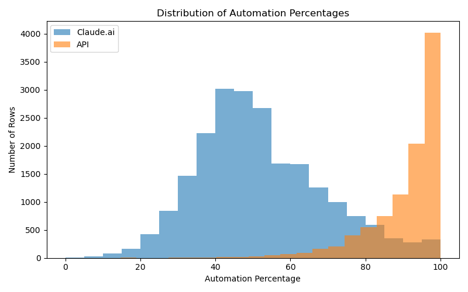
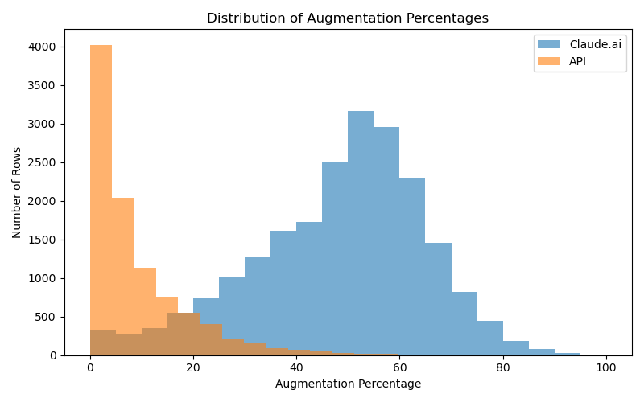
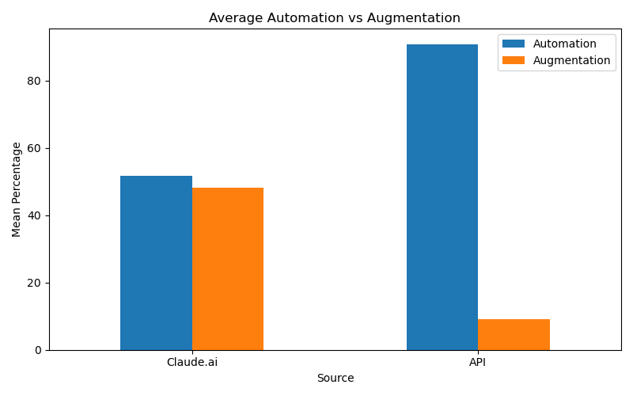

# Exploratory Profile

## Research Question:
Do consumers using Claude.ai and businesses using the Anthropic first-party API differ in how they use AI on the same work tasks, particularly in their use of automation versus augmentation?

## Automation Distribution:

The automation distribution shows a strong difference between Claude.ai and API usage. Claude.ai has an average automation percentage of approximately 50% that is more centered around the middle of the scale. The API has a much higher average of approximately 90%. API values are concentrated near the upper end of the scale, with a median automation percentage of 94%.

## Augmentation Distribution:

The augmentation distribution shows the opposite pattern. Claude.ai has an average augmentation percentage of approximately 48% that is concentrated around the middle of the scale. API augmentation with only 9% and centered near zero. The median augmentation percentage is about 50% for Claude.ai and about 9% for the API.

## Average Automation vs. Augmentation:

The average comparison shows that Claude.ai usage is relatively balanced between automation and augmentation. API usage is strongly concentrated toward automation. In this initial exploratory analysis, API interactions appear much more likely to be automation-oriented than Claude.ai interactions.

## Initial Observations:
The results provide early evidence that Claude.ai and API usage differ in interaction style. Claude.ai usage is close to evenly split between automation and augmentation. However, API usage is concentrated toward automation. These results are descriptive and should not yet be treated as the final answer to the research question. The current comparison uses all available rows for each metric and does not yet restrict the analysis to the exact same O*NET tasks across both datasets.
