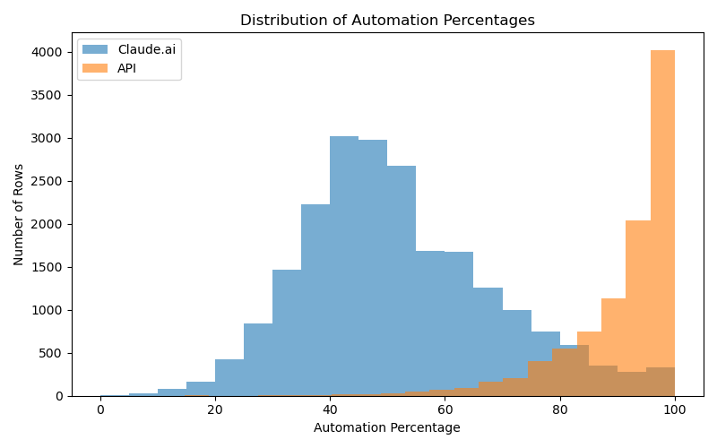
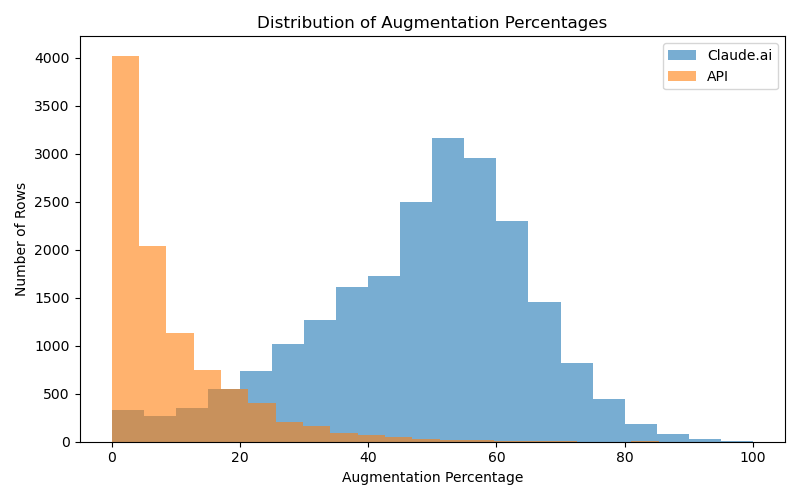
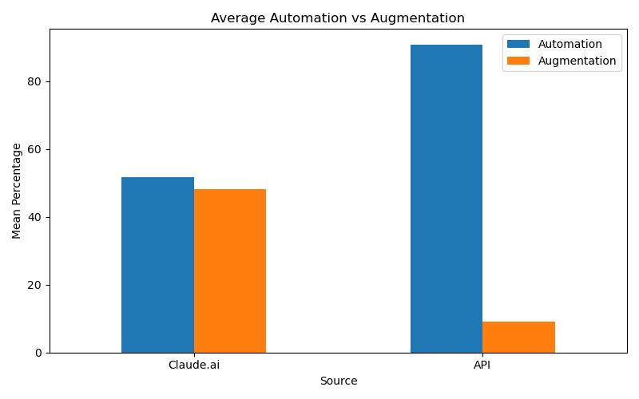

# Exploratory Profile

## Research Question

**Do consumers using Claude.ai and businesses using the Anthropic first-party API differ in how they use AI on the same work tasks, particularly in their use of automation versus augmentation?**

## Dataset

This analysis uses the **June 26, 2026 release of the Anthropic Economic Index**.

Two datasets are used:

- **Claude.ai:** consumer usage
- **Anthropic first-party API:** business/enterprise usage

The June 2026 release was selected as the starting point because it provides separate Claude.ai and first-party API datasets, allowing the two sources to be compared within the same release.

The inventory found:

| Source | Rows | Columns |
|---|---:|---:|
| Claude.ai | 1,636,573 | 10 |
| API | 491,705 | 10 |

Both files contained the same 10 columns and no missing values were found during the initial inventory.

---

## Key Metrics

The initial analysis focuses on two metrics:

- `collaboration_bucket_automation_pct`
- `collaboration_bucket_augmentation_pct`

---

## Automation Distribution

The automation distribution shows a strong difference between Claude.ai and API usage. Claude.ai has an average automation percentage of approximately 50% that is more centered around the middle of the scale. The API has a much higher average of approximately 90%. API values are concentrated near the upper end of the scale, with a median automation percentage of 94%.

This suggests that API usage is substantially more automation-oriented in the initial exploratory analysis.

---

## Augmentation Distribution

The augmentation distribution shows the opposite pattern. Claude.ai has an average augmentation percentage of approximately 48% that is concentrated around the middle of the scale. API augmentation with only 9% and centered near zero. The median augmentation percentage is about 50% for Claude.ai and about 9% for the API.

This suggests that Claude.ai interactions contain substantially more augmentation-oriented usage than API interactions.

---

## Average Automation vs. Augmentation

The average comparison provides the clearest initial view of the difference between the two sources.

| Source | Automation | Augmentation |
|---|---:|---:|
| Claude.ai | ~52% | ~48% |
| API | ~91% | ~9% |

Claude.ai usage appears relatively balanced between automation and augmentation, while API usage is strongly concentrated toward automation. These percentages are averages across the available metric rows and should not be interpreted as the percentage of all business or consumer tasks that are automated.

---

## Initial Finding

The results provide early evidence that Claude.ai and API usage differ in interaction style. Claude.ai usage is close to evenly split between automation and augmentation. However, API usage is concentrated toward automation. These results are descriptive and should not yet be treated as the final answer to the research question. The current comparison uses all available rows for each metric and does not yet restrict the analysis to the exact same O*NET tasks across both datasets.

---

## Current Limitation

The current analysis calculates the automation and augmentation distributions using all available rows for each metric. This means the analysis does not yet restrict the comparison to the exact same O*NET work tasks in the Claude.ai and API datasets.

For example, if one dataset contains a different mix of tasks than the other, part of the observed difference could be caused by the types of tasks represented rather than by consumer versus business usage itself.

Because the research question asks whether consumers and businesses use AI differently on the same work tasks, an apples-to-apples task comparison is needed.

---

## Next Steps

The next stage of the analysis will match identical O*NET tasks between the Claude.ai and API datasets. For each shared task, the analysis will compare its automation percentage between the two sources.

A task-level automation gap can then be calculated as:

**Automation Gap = API Automation % - Claude.ai Automation %**

This will make it possible to determine:

- how many O*NET tasks appear in both datasets
- whether API usage remains more automation-oriented when the exact same tasks are compared
- the average automation gap across matched tasks
- which tasks have the largest and smallest differences
- whether the preliminary overall pattern remains after controlling for differences in task composition.

Further statistical analysis will be selected after the matched-task dataset is constructed and examined.